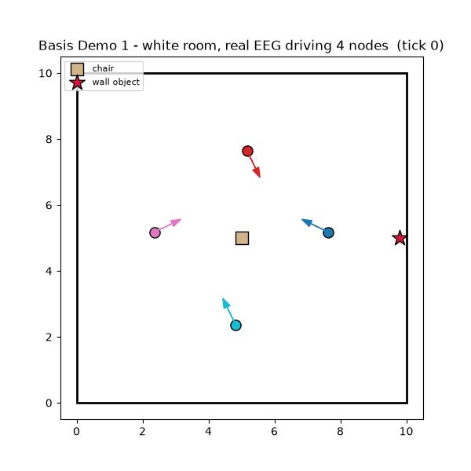

# Demo 1 — real EEG driving nodes in the shared white room

The first visual milestone. N Basis Brains replay real EEGMMIDB motor-imagery
signals; each signal flows through the full stack and moves that node in one
shared room. You watch real recorded brain activity drive agents in a shared
space.



## What you are seeing
- A top-down **white room** (basis-stack section 5) with a chair and one wall
  object (the star).
- Each **dot** is a node (one EEGMMIDB subject); the arrow is its heading, the
  faint line its trail.
- Motion is **decoded from real motor-imagery band power**: left-hand imagery
  turns a node left, right-hand imagery turns it right (C3/C4 lateralization).

## The loop behind each frame
`Brain.emit()` → SNP validate → Fabric (pass-through) → Locus decode+apply →
perception update → SNP. Basis TRACE times every step (printed on exit).

Fabric is a pass-through seam here: a single Locus is one authority, so no
distributed consensus is needed yet (see the stack README).

## Run it

```bash
# real EEG (downloads EEGMMIDB subjects on first run)
python demos/demo1_room/run.py --nodes 4 --ticks 100 --subjects 1,2,3,4

# offline, no download (synthetic signal)
python demos/demo1_room/run.py --synthetic --nodes 4 --ticks 100
```

Requires the `viz` extra: `pip install -e ".[viz]"`.
